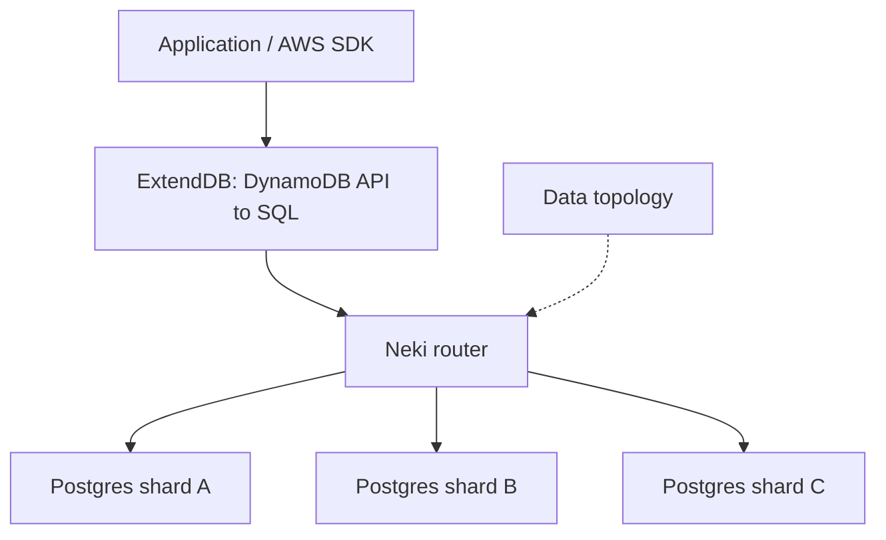
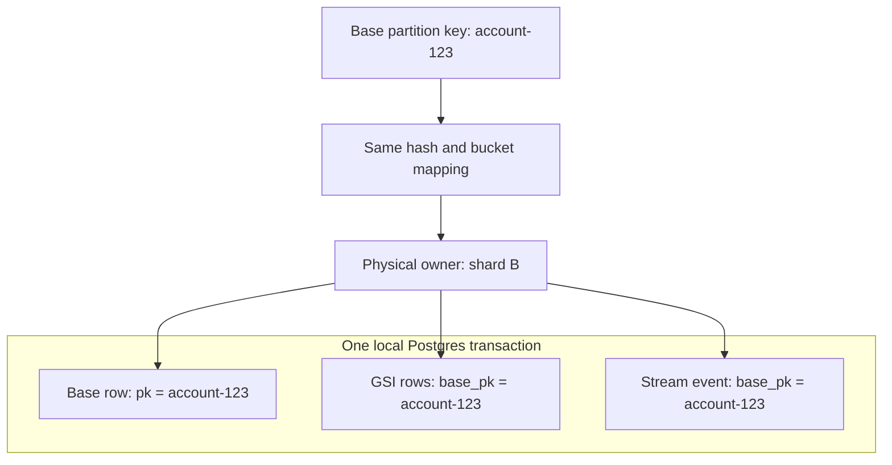
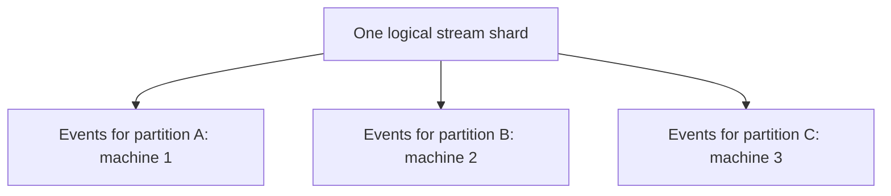
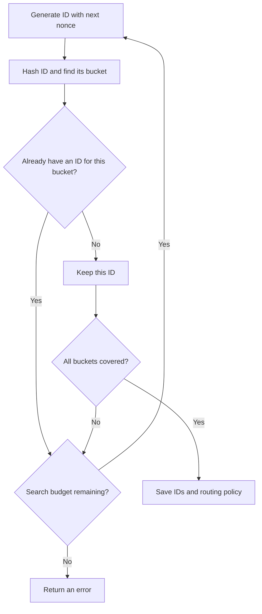

Recently PlanetScale announced [Neki](https://planetscale.com/blog/introducing-neki), a system for operating sharded Postgres at massive scale. As someone who's used Postgres in anger, this got my attention. Real Postgres, with a routing layer built by people who've spent years operating Vitess. That's a pretty appealing starting point.

But the thing that sent me down this particular rabbit hole was another announcement.

## Meanwhile at Amazon

AWS released [ExtendDB](https://aws.amazon.com/about-aws/whats-new/2026/05/aws-extenddb-dynamodb/), an open source DynamoDB-compatible adapter with a pluggable storage engine. Its first backend was Postgres.

We've used DynamoDB extensively at Twisp for the past five years. We know its quirks, we've built around its constraints, and we have a lot of software that speaks its language. So an implementation we could run ourselves was immediately interesting. We already have a branch of Twisp running against ExtendDB and passing our internal tests.

There are customers who need their data to stay in a particular country, where the nearest AWS region is a hop, skip, and a jump across a border. Being able to take our existing application somewhere else opens up options: another cloud, a local provider, an on-prem deployment.

The next question is how to keep the horizontal scalability we built around.

DynamoDB's API. Postgres underneath. Neki distributing the data.

I was jazzed enough to start reading code.

## Surely This Is Mostly Configuration

Neki puts a router between the application and the Postgres nodes. The router parses SQL and uses a configured data topology to work out which shards need to participate. PlanetScale's [architecture overview](https://planetscale.com/docs/neki) describes the arrangement.



My initial intuition was that this would be mostly a matter of finding the physical tables ExtendDB creates and telling Neki to shard them by partition key.

For a base table, that intuition holds up pretty well. DynamoDB already makes you choose a partition key. The application has done a lot of the hard thinking before the database gets involved.

Then you get to the features that make DynamoDB so useful: global secondary indexes and streams. One API call can produce several physical writes. Those writes need to agree about where they live.

This is where "mostly configuration" starts earning its quotation marks.

## One Item, Several Rows

I'd already run into the index side of this while investigating [slow GSI propagation in ExtendDB](https://github.com/ExtendDB/extenddb/issues/115). The indexes have their own Postgres tables, and maintaining them means finding the rows derived from a particular base item.

That gives us a useful piece of data: `base_pk`. The index can have its own lookup key, but it also knows the partition key of the item it came from.

For this deployment, I want the base row routed by `pk` and its derived rows routed by that same value in `base_pk`. A `PutItem` or `UpdateItem` should be able to update the item, maintain its synchronous indexes, and capture its stream event on one machine, in one transaction.



The reason is correctness. Neki's [transaction guidance](https://planetscale.com/docs/neki/best-practices) explicitly says that transactions crossing shards do not provide atomic commit across all of them. Having one node commit while another rolls back is a fairly exciting way to discover that your item and its index disagree.

Distributed commit protocols have their own costs: coordination, recovery, and deciding what to do when a participant disappears at precisely the wrong moment. We've spent a lot of time on transaction semantics at Twisp; [Galois wrote about our work together on the transaction manager](https://www.galois.com/articles/galois-twisp-avoiding-foolishness-in-distributed-systems). I have no desire to accidentally create another distributed transaction problem while wiring up a storage backend.

For this unit of work, the useful move is to keep the related writes together.

ExtendDB already captured the stream event in the same SQL transaction as the item. The change adds the routing information needed to keep that transaction local. It adds `base_pk` to stream records and pending index work, using the same encoding as the base row.

One qualification: if GSI propagation is delayed, the local transaction contains the pending work, and the actual index update happens later. To have the GSI rows themselves commit with the item, the effective propagation delay needs to be zero.

Placing a GSI by `base_pk` also means a lookup using only its index key may need to fan out. This placement choice buys local writes; it doesn't make every access pattern local.

## Streams Ain't So Easy

Adding the routing column to a stream event is straightforward. The event knows the item's key. Here's the relevant part of an insert event, with the other fields omitted:

```json
{
  "eventName": "INSERT",
  "dynamodb": {
    "Keys": {
      "pk": { "S": "account-123" },
      "sk": { "S": "entry-456" }
    },
    "NewImage": {
      "pk": { "S": "account-123" },
      "sk": { "S": "entry-456" },
      "amount": { "N": "125" }
    }
  }
}
```

For this key schema, the encoded `base_pk` is `account-123`. The sort key doesn't participate in placement. Deletes get the key from the old item; composite partition keys use all of their HASH attributes through the existing encoder.

So the write lands with the base row. Great.

The consumer, however, doesn't ask for `account-123`. It asks for a stream shard.

Before this change, ExtendDB created four logical stream shards per table and assigned events using CRC32 of the first key attribute, modulo four. That grouping has no necessary relationship to Neki's physical placement. A single logical stream shard can contain records spread across several machines.



Now a consumer trying to read, lock, and checkpoint its work is back in the same situation: one logical unit spread across several physical transaction boundaries.

The requirement is that **every record in a logical stream shard has one physical owner**. Several partition keys can share that stream shard, and several stream shards can share a machine. We just can't have one stream shard straddling machines.

## Make the Hashes Agree

The condition we need is small enough to fit on one line:

```text
bucket(hash(base_pk)) == bucket(hash(shard_id))
```

Same bucket. The complete hash values can be different.

ExtendDB needs to use the same hash algorithm, seed, key encoding, and bucket mapping as the physical router. Then it assigns all partition keys in a bucket to that bucket's stream shard.

There's one wrinkle: the shard ID is itself a string. Naming it `shard-2` doesn't magically make it hash into bucket 2.

So we search for a name that does.

The new IDs have this shape:

```text
shardId-<table UUID>-<nonce padded to 16 decimal digits>
```

At stream creation, generate a candidate, hash it, and keep it if we haven't found an ID for that bucket yet. Repeat until every bucket has one. The search is bounded, so failure produces an error instead of spinning forever.



This happens when the stream is created. Writes use the saved mapping. They don't go hunting for a new shard ID every time someone changes an item.

I like the outcome: We get IDs that behave correctly under ordinary hash routing, without teaching ExtendDB which machine owns which bucket. Neki stays in charge of the topology.

I am a little scared of how we get that outcome. The IDs agree with the partition keys under today's bucket layout. Add more buckets, and that agreement can disappear: a record and its stream ID can land on opposite sides of a new boundary. What happens to existing events and consumers holding those IDs? Maybe there's a way to name a range and let Neki track it instead. I don't have that part figured out. If you've solved something like this, I'd love to hear how.

## The Configuration Part, Finally

On the ExtendDB side, the configuration for four equal hash ranges looks like this:

```toml
[storage.postgres.stream_sharding]
hash = "xxh3_64"
mapping = "hash_range"
bucket_count = 4
seed = 0
```

Neki calls its corresponding shard-index type `xxhash`; specifically, it uses XXH3-64. This fragment shows the three routing keys involved, rather than a complete deployment configuration:

```json
{
  "shard_indexes": {
    "base": { "type": "xxhash", "columns": ["pk"] },
    "derived": { "type": "xxhash", "columns": ["base_pk"] },
    "stream": { "type": "xxhash", "columns": ["shard_id"] }
  }
}
```

The groups using those indexes need matching physical owners for matching ranges. With four equal ranges, the boundaries are `40`, `80`, and `c0` in the hexadecimal hash space. Neki's [data topology documentation](https://planetscale.com/docs/neki/data-topology) explains those bindings.

The deployment also needs a route for stream-record reads filtered by `shard_id`. Merely placing those rows by `base_pk` doesn't configure that alternate read path. Once the routing is in place, the matching hashes let that query reach the same owner through an ordinary connection. ExtendDB doesn't need a pool per node or a session override.

I've included the fuller placement template and verification queries in the [deployment guide](https://github.com/parsnips/extenddb/blob/89d37afeb8275c2337fdb6fc403609d07cb22006/docs/neki-stream-sharding.md).

The mapping is persisted with the stream. Changing the config doesn't reshuffle an existing stream underneath its consumers. Existing streams retain their legacy assignment, so turning this on for an established deployment needs a migration plan. Likewise, a future physical split must respect the bucket boundaries if a stream shard is going to keep its single owner.

There's another small but useful change: fetching the list of stream shards happens before the item transaction starts. Enumerating that list can touch several owners. It shouldn't pull them all into a transaction that only needs to write one item's data.

## Where This Leaves Things

With AI assistance, I've put the work into [my ExtendDB fork](https://github.com/parsnips/extenddb/commit/89d37afeb8275c2337fdb6fc403609d07cb22006).

The PostgreSQL tests cover hash vectors, generated shard IDs, key encoding, transaction capture and rollback, and stream reads. Running this against a live Neki deployment is the next step. I want to see the actual query plans and exercise failures, not just admire the arrows in these diagrams.

All in all, this is super promising. We can keep the DynamoDB interface our application already understands and make its related writes line up with Postgres's local transaction boundary. That gets us closer to taking Twisp to places we couldn't run it before, while keeping a path to horizontal scale.

I'm pretty excited to get my two favorite databases in the same room and see what breaks.

Happy hacking!
